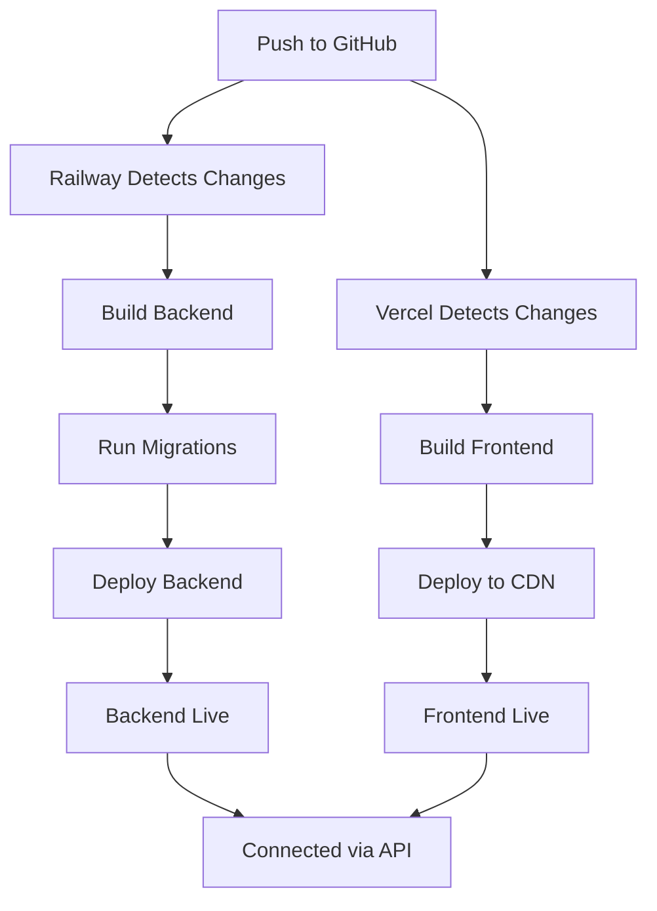

# 🚀 LegalKonect - Hosting Ready!

Your LegalKonect application is now configured for production deployment with:
- **Railway** (Backend API)
- **Vercel** (Frontend)
- **Cloudflare R2** (Encrypted Storage)

---

## 📁 Files Added/Modified

### Configuration Files
- ✅ `railway.json` - Railway deployment configuration
- ✅ `vercel.json` - Vercel deployment configuration
- ✅ `backend/composer.json` - Added `league/flysystem-aws-s3-v3` for R2 support
- ✅ `backend/config/filesystems.php` - Added R2 disk configuration
- ✅ `backend/routes/api.php` - Added `/health` endpoint

### Environment Templates
- ✅ `backend/.env.production.example` - Production backend environment variables
- ✅ `frontend/.env.production.example` - Production frontend environment variables

### Documentation
- ✅ `HOSTING_SETUP_GUIDE.md` - Comprehensive hosting setup instructions
- ✅ `QUICK_DEPLOY.md` - Quick 30-minute deployment guide
- ✅ `DEPLOYMENT_CHECKLIST.md` - Step-by-step deployment checklist

---

## 🎯 Quick Start

Choose your guide based on your needs:

### 🏃 Want to deploy quickly?
→ Follow **[QUICK_DEPLOY.md](QUICK_DEPLOY.md)** (30 minutes)

### 📚 Want detailed instructions?
→ Follow **[HOSTING_SETUP_GUIDE.md](HOSTING_SETUP_GUIDE.md)** (comprehensive)

### ✅ Want a checklist?
→ Use **[DEPLOYMENT_CHECKLIST.md](DEPLOYMENT_CHECKLIST.md)** (step-by-step)

---

## 🔑 Key Features Configured

### ✅ Cloudflare R2 Storage
- Encrypted lawyer credentials storage
- Profile pictures and documents
- Payment QR codes
- S3-compatible API

### ✅ Railway Backend
- Automatic MySQL database
- Laravel optimizations
- Health check endpoint
- Auto-migrations on deploy

### ✅ Vercel Frontend
- React build optimization
- Static asset caching
- Global CDN distribution
- Automatic SSL

---

## 🔒 Security Features

- ✅ Encrypted document storage with dedicated key
- ✅ HTTPS enforced on all services
- ✅ CORS configured for production
- ✅ Session security with Sanctum
- ✅ Environment variables secured
- ✅ Database credentials protected

---

## 📊 What's Different from Local?

| Feature | Local | Production |
|---------|-------|------------|
| **Storage** | Local filesystem | Cloudflare R2 (cloud) |
| **Database** | Local MySQL/XAMPP | Railway MySQL |
| **Frontend** | localhost:3000 | Vercel CDN |
| **Backend** | localhost:8000 | Railway container |
| **SSL/HTTPS** | Not required | Automatic |
| **Environment** | `.env` file | Platform environment variables |

---

## ⚠️ CRITICAL: Before You Deploy

### 1. Encryption Key
The `DOCUMENT_ENCRYPTION_KEY` in your `.env` file **MUST** be copied to production:

```env
DOCUMENT_ENCRYPTION_KEY=base64:sIrk+RzEacYWu1HLGLg16X2yPCzA9yFoAsJ8XbO6kRY=
```

**⚠️ If this key changes, all encrypted lawyer credentials will be lost forever!**

### 2. Update URLs
After deployment, update these in Railway:
- `APP_URL` → Your Railway URL
- `FRONTEND_URL` → Your Vercel URL
- `SANCTUM_STATEFUL_DOMAINS` → Your Vercel domain (without https://)

### 3. Install AWS S3 Package
Before deploying, run:
```bash
cd backend
composer install
```

This installs `league/flysystem-aws-s3-v3` needed for R2.

---

## 🧪 Testing Your Deployment

After deployment, test these features:

1. **User Registration** - Create test account
2. **Lawyer Registration** - Upload credentials (tests R2)
3. **Login/Logout** - Test authentication
4. **Appointments** - Book test appointment
5. **Payment Upload** - Upload payment proof (tests R2)
6. **Admin Login** - Verify admin dashboard access
7. **Email** - Check email notifications work

---

## 💰 Estimated Monthly Costs

### Minimal Setup (Small-scale)
- Railway Hobby: **$5/month** (500 hours)
- Vercel Hobby: **Free** (100GB bandwidth)
- Cloudflare R2: **~$1-2/month** (storage + operations)
- **Total: ~$6-7/month**

### Production Setup (Medium-scale)
- Railway Pro: **$20/month** (unlimited)
- Vercel Pro: **$20/month** (1TB bandwidth)
- Cloudflare R2: **~$5-10/month**
- **Total: ~$45-50/month**

---

## 🆘 Common Issues & Solutions

### "CORS Error"
**Solution**: Verify `FRONTEND_URL` in Railway matches your Vercel URL exactly

### "Storage Upload Failed"
**Solution**: Check R2 credentials are correct, verify bucket exists

### "Database Connection Failed"
**Solution**: Ensure Railway MySQL service is running and linked

### "Session/Auth Not Working"
**Solution**: Verify `SANCTUM_STATEFUL_DOMAINS` matches Vercel domain (no https://)

### "Email Not Sending"
**Solution**: Check Resend API key is valid and from address is verified

---

## 📞 Support Resources

- **Railway**: https://railway.app/help
- **Vercel**: https://vercel.com/support
- **Cloudflare**: https://support.cloudflare.com
- **Laravel**: https://laravel.com/docs

---

## 🔄 Deployment Workflow



---

## ✨ What's Next?

After successful deployment:

1. **Custom Domain** (optional)
   - Add to Vercel and Railway
   - Update environment variables
   - Configure DNS

2. **Monitoring**
   - Set up Railway alerts
   - Enable Vercel analytics
   - Monitor R2 usage

3. **Backups**
   - Database (Railway automatic)
   - R2 versioning (optional)
   - Environment variables backup

4. **Performance**
   - Enable caching if needed
   - Optimize images
   - Monitor response times

5. **Security**
   - Change default admin password
   - Review access logs
   - Set up rate limiting

---

## ✅ Deployment Status

- [ ] Cloudflare R2 bucket created
- [ ] Railway backend deployed
- [ ] Vercel frontend deployed
- [ ] Environment variables configured
- [ ] Health check passes
- [ ] Test user can register
- [ ] Test lawyer can register
- [ ] Appointments work
- [ ] Payments work
- [ ] Admin access works

---

## 📝 Notes

- All services provide automatic SSL/HTTPS
- Railway and Vercel auto-scale based on traffic
- R2 has no egress fees (unlike AWS S3)
- Database backups are automatic on Railway
- Git push triggers automatic redeployment

---

**Ready to deploy? Start with [QUICK_DEPLOY.md](QUICK_DEPLOY.md)!**

